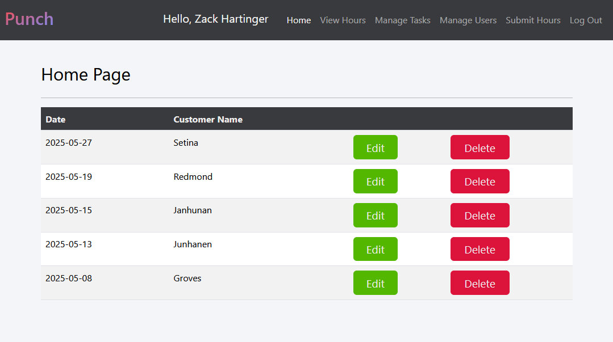
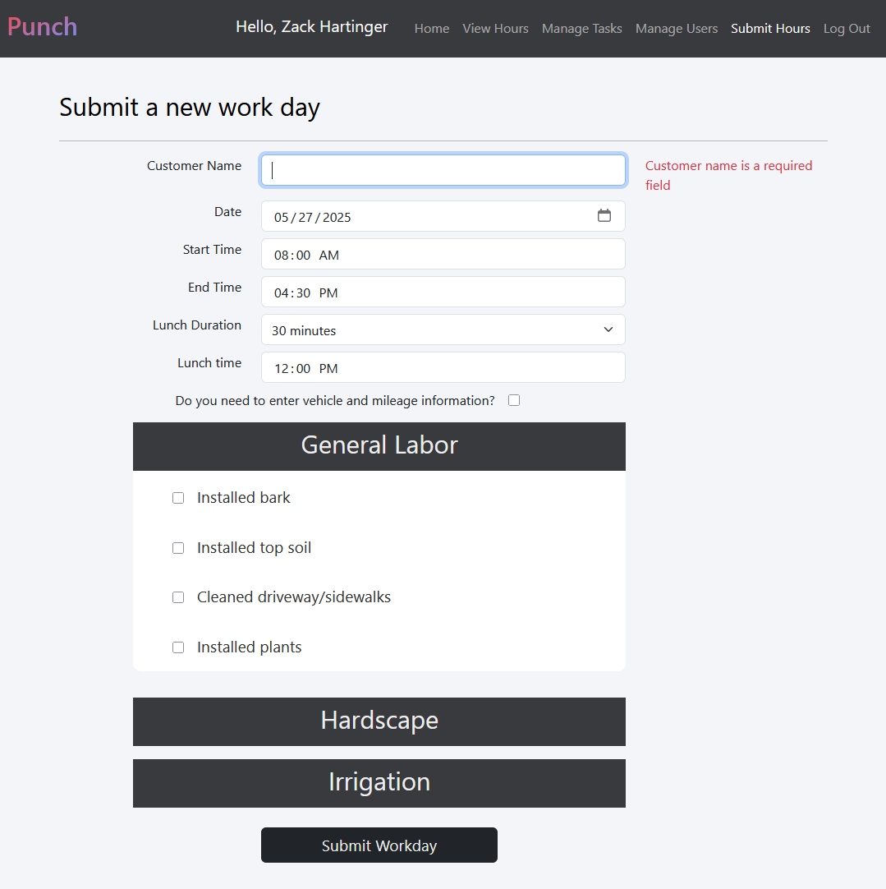
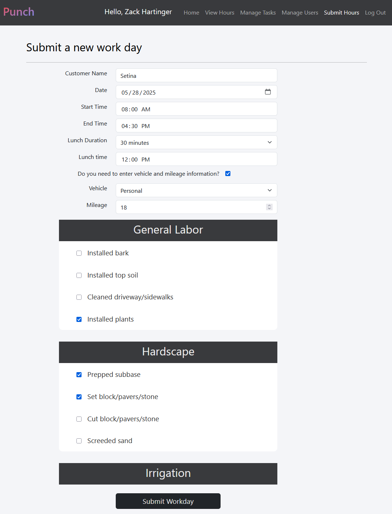
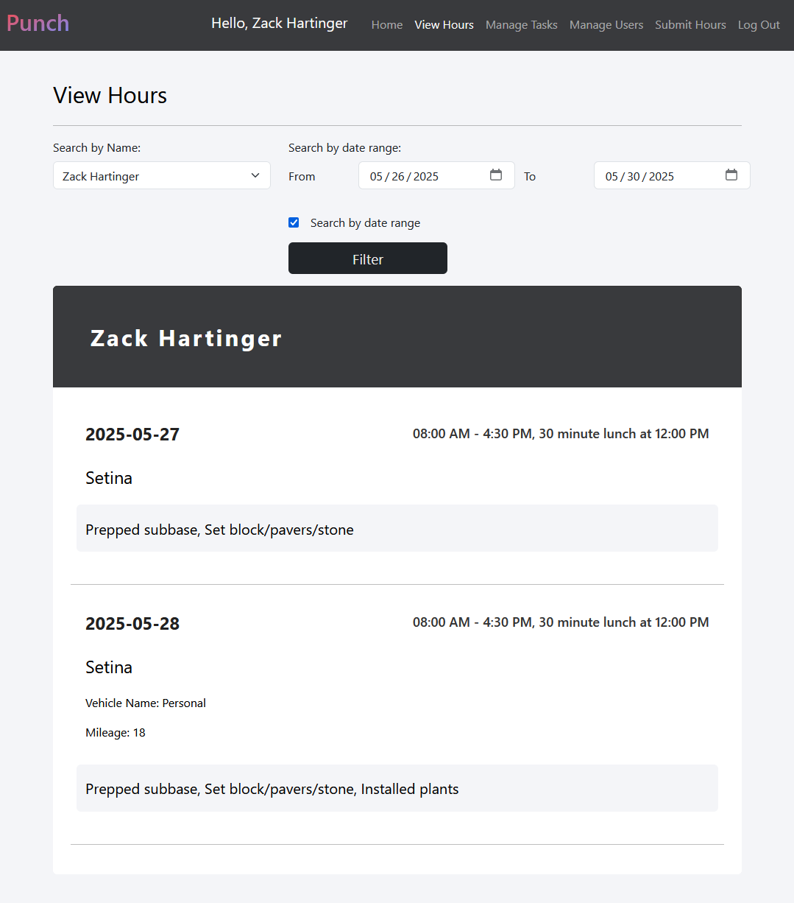
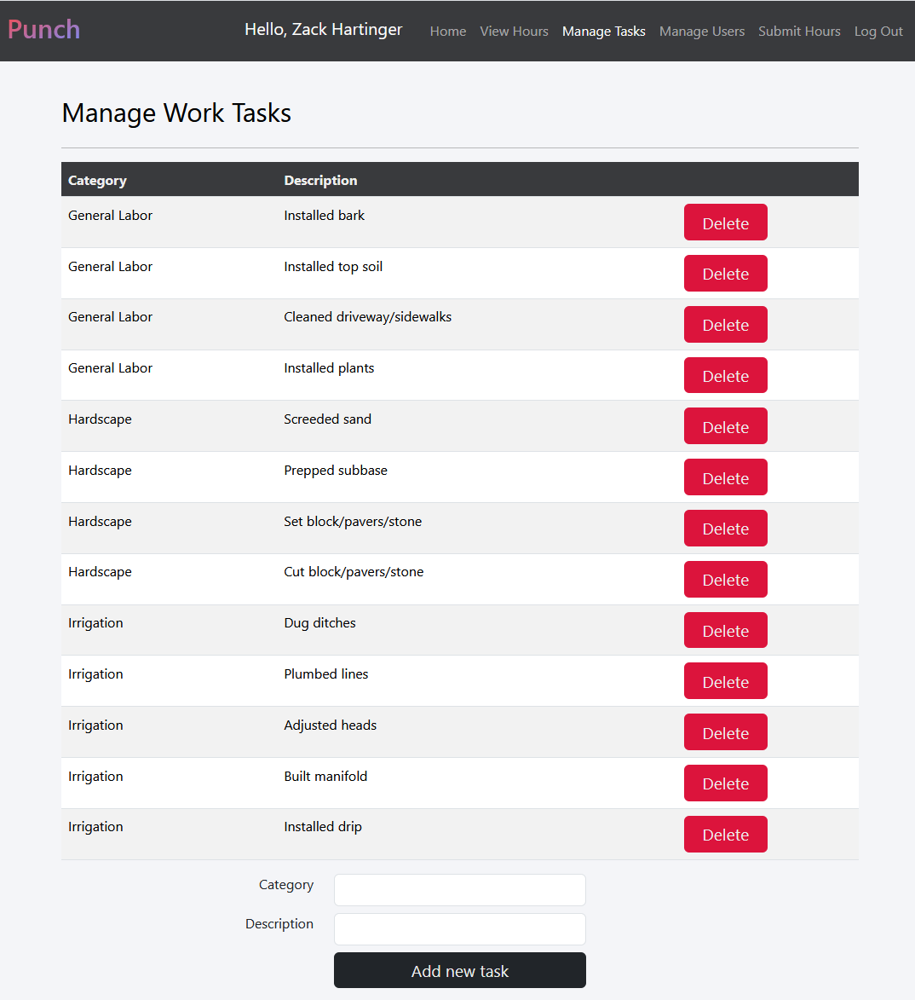

<h1>Punch Time Management</h1>
<h3>A React front end for submitting and tracking employee hours, work tasks and more.</h3>

<h2>About Punch</h2>

Punch is my work in progress HR solution that seeks to simplify submitting time cards and provide a full suite of features to view employee data for payroll and invoicing. This client app will be served by a RESTful API written in C# .NET Core which will handle authentication and CRUD operations.

<h2>Features/Technologies used:</h2>
<ul>
  <li>React</li>
  <li>Authentication management using Context API</li>
  <li>Private routing based on user roles</li>
  <li>Invite only sign up system</li>
</ul>

<h2>Why I'm building this</h2>

I first wanted to create this app as a way to simplify hours submission for myself and my team. As of now we have to send an email every day to our HR manager outlining hours worked, customer info, work tasks completed, etc. My first version simply sent an email based on form input, however, I realized there was an opportunity to make a robust full stack application to also simplify and speed up the payroll process for our manager. Clicking through 10 or more emails a day and trying to parse out what workers did is exhausting and a waste of resources. Punch will eleminate this problem by getting everyone on unified, professional verbiage to describe their workday and allow all of this data to be read on a single page drastically decreasing the time that goes into our current system.

    
  
Once logged in, the Home Page will display a table of the user's last 5 work days submitted, with buttons to edit or delete them.

---

  
  
    
  
To submit a new workday, users will fillout a simple form with some default values to speed up the process. Work tasks are categorized and each stored in their own collapsible component. Users can simply check which tasks they completed in a day and when they are done click submit! Done! No more drafting emails after a long work day!

---

  
    
  
Users with Admin permissions will be able to view all employee work day data with some filtering options to help them complete their administrative duties.

---

  
    
  
Users with Admin permissions will be able to manage the work tasks that will be available in the submit hours form. Deleting tasks will not actually "delete" them from the database but will remove them from the form inputs. This ensures referential integrity and allows deleted or deprecated tasks to still be present on already submitted workdays

> [!NOTE]
> 
Punch is designed with a mobile first approach and built to be responsive to a variety of device sizes, ensuring a good user experience.

